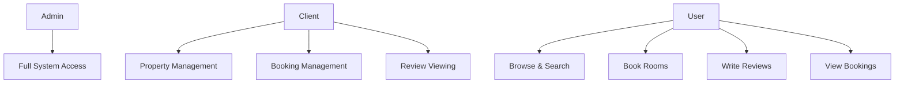
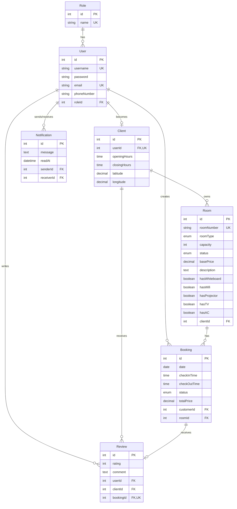
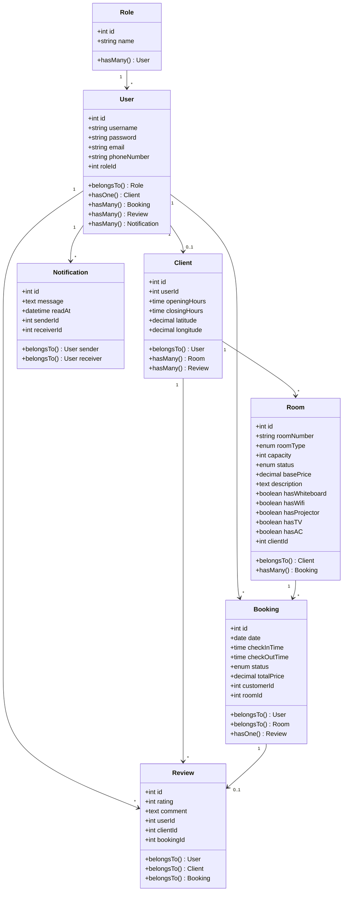
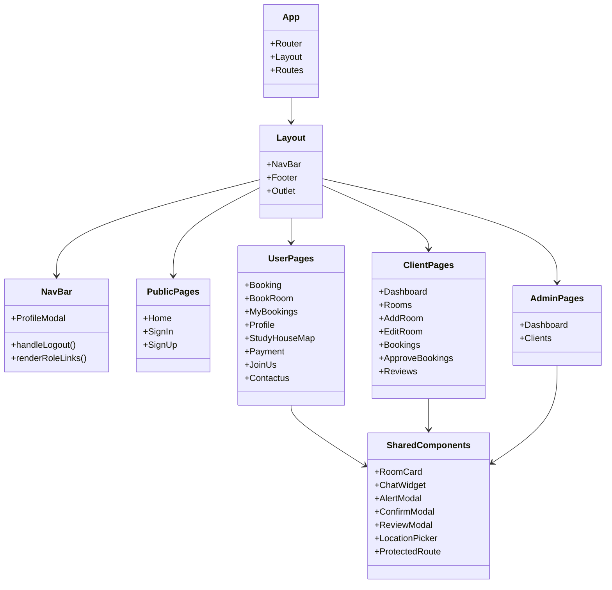
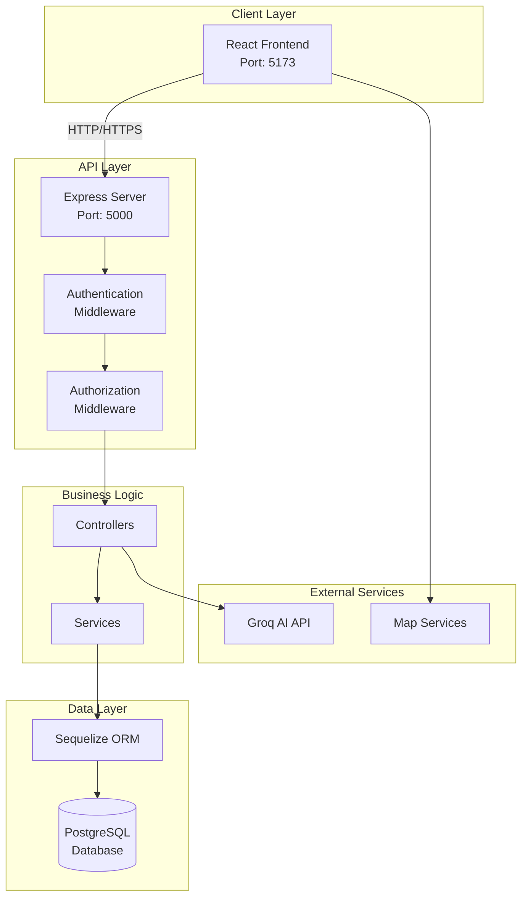
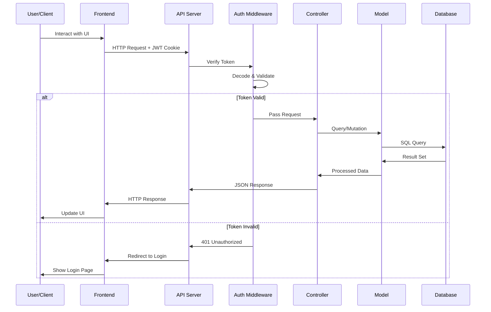
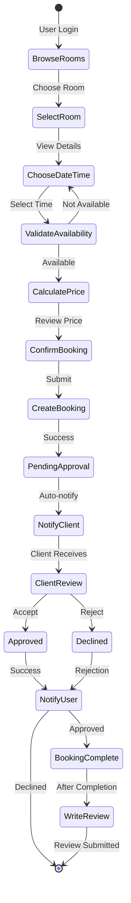
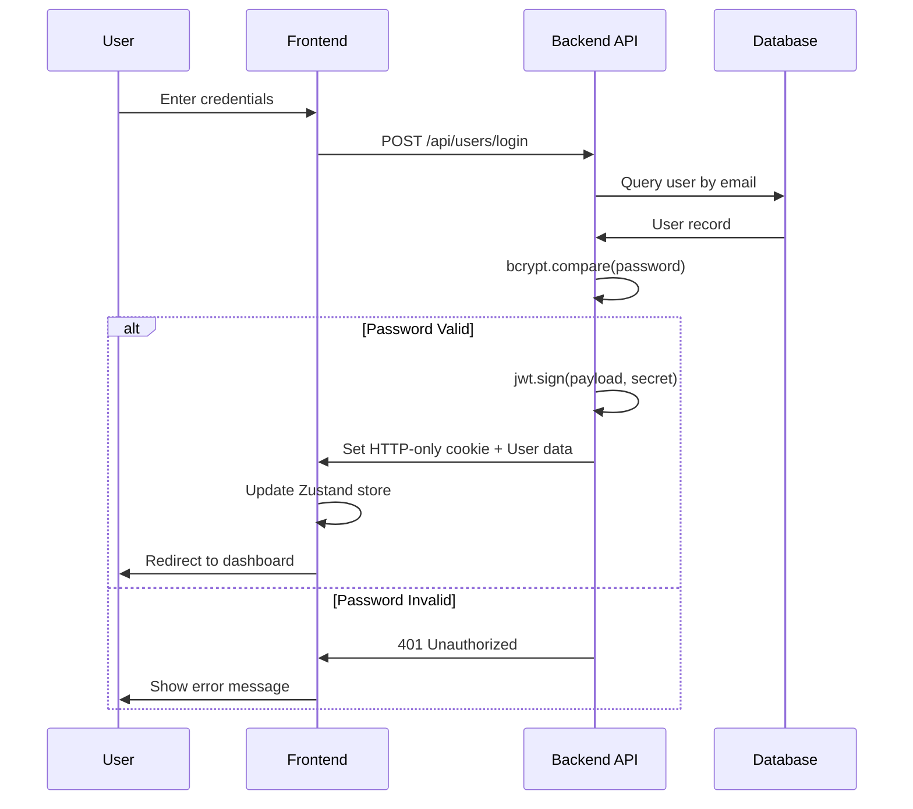
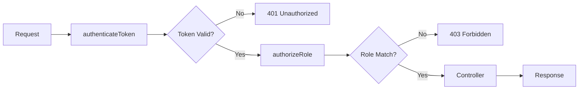

# EHJEZ - Study Room Booking Platform
## Comprehensive Project Documentation

---

## Table of Contents
1. [Project Overview](#project-overview)
2. [Functional Requirements](#functional-requirements)
3. [Use Cases](#use-cases)
4. [User Roles & Permissions](#user-roles--permissions)
5. [Database Schema](#database-schema)
6. [Class Diagrams](#class-diagrams)
7. [System Architecture](#system-architecture)
8. [API Documentation](#api-documentation)
9. [Component Architecture](#component-architecture)
10. [Business Logic & Workflows](#business-logic--workflows)

---

## 1. Project Overview

### 1.1 Description
EHJEZ is a comprehensive study room booking platform that connects students and professionals with study houses offering various types of workspaces. The platform enables users to discover, book, and review study rooms while providing study house owners (clients) with tools to manage their properties and bookings.

### 1.2 Technology Stack

#### Backend
- **Framework**: Node.js with Express.js
- **Database**: PostgreSQL
- **ORM**: Sequelize
- **Authentication**: JWT (JSON Web Tokens) with cookie-based sessions
- **Password Security**: bcrypt
- **AI Integration**: Groq SDK for chat functionality
- **Additional Libraries**: 
  - CORS for cross-origin requests
  - cookie-parser for session management
  - axios for HTTP requests

#### Frontend
- **Framework**: React 19
- **Build Tool**: Vite
- **Routing**: React Router DOM v7
- **State Management**: Zustand
- **Styling**: SASS/SCSS
- **UI Components**: 
  - React Icons
  - React Toastify (notifications)
  - React DatePicker
- **Maps**: Leaflet & React Leaflet, Mapbox GL
- **HTTP Client**: Axios

### 1.3 Key Features
- Multi-role user system (Admin, Client, User)
- Real-time room availability checking
- Advanced filtering and search capabilities
- Interactive map integration for location-based search
- Booking management with time-slot validation
- Review and rating system
- Notification system
- AI-powered chat assistance
- Client dashboard for property management
- Admin dashboard for platform oversight

---

## 2. Functional Requirements

### 2.1 Common System Requirements
1. System shall support user registration with email validation
2. System shall authenticate users via JWT tokens
3. System shall support three user roles: Admin, Client, and User
4. System shall maintain session persistence via HTTP-only cookies
5. All users shall be able to edit their profile information
6. All users shall be able to securely logout
7. System shall provide AI-powered chat support
8. Chat shall assist users with platform navigation and questions

### 2.2 User (Customer) Requirements

#### 2.2.1 Room Discovery & Search
1. Users shall be able to browse all available rooms
2. Users shall be able to filter rooms by type (single, double, suite, classroom, meeting_room, private_office, coworking)
3. Users shall be able to filter rooms by venue (study house)
4. Users shall be able to sort rooms by price (low-to-high, high-to-low)
5. Users shall be able to view room details including amenities (WiFi, AC, Projector, TV, Whiteboard)
6. System shall display room availability in real-time
7. Users shall be able to view study houses on an interactive map
8. Users shall be able to filter by proximity to their location
9. System shall calculate and display distances between user and study houses

#### 2.2.2 Booking Management
1. Users shall be able to view available time slots for rooms
2. Users shall be able to create bookings with date, check-in time, and check-out time
3. System shall calculate total price based on duration and base price
4. System shall validate booking times against client operating hours
5. System shall prevent double-booking of rooms
6. Users shall be able to view their booking history
7. Users shall be able to filter their bookings by room type
8. Users shall see booking status (pending, approved, declined, cancelled)
9. System shall prevent bookings for dates in the past
10. System shall validate price calculations (±$0.01 tolerance)

#### 2.2.3 Review System
1. Users shall be able to review completed approved bookings
2. Reviews shall include ratings (1-5 stars) and optional comments
3. Each booking shall allow only one review
4. System shall verify booking completion before allowing reviews
5. Users shall be able to edit their reviews
6. Users shall be able to delete their reviews
7. Users shall be able to view all reviews for any study house

#### 2.2.4 Feedback Messages
1. Users shall receive toast notifications for successful bookings
2. Users shall receive error messages for failed operations
3. Users shall see confirmation messages for actions like cancellations

### 2.3 Client (Study House Owner) Requirements

#### 2.3.1 Room Management
1. Clients shall be able to create new rooms with detailed specifications
2. Clients shall specify room type: single, double, suite, classroom, meeting_room, private_office, coworking
3. Clients shall configure room features (WiFi, AC, Projector, TV, Whiteboard)
4. Clients shall set room capacity (number of people)
5. Clients shall set base price per hour for each room
6. Clients shall be able to add room descriptions
7. Clients shall be able to update room information
8. Clients shall be able to delete their rooms
9. Clients shall be able to set room status (available, maintenance, inactive)
10. Each room shall have unique room number
11. Clients shall be able to view all their owned rooms

#### 2.3.2 Booking Management
1. Clients shall view all bookings for their rooms
2. Clients shall be able to approve pending bookings
3. Clients shall be able to decline pending bookings
4. Clients shall be able to cancel approved bookings
5. Clients shall be able to delete bookings for their rooms
6. System shall notify clients of new booking requests
7. Clients shall view booked time slots for their rooms

#### 2.3.3 Property Configuration
1. Clients shall provide geographic coordinates (latitude, longitude) for their properties
2. Clients shall set operating hours (opening and closing times)
3. System shall enforce bookings only within operating hours
4. Clients shall have property information displayed on map

#### 2.3.4 Analytics & Reviews
1. Clients shall view statistics for their properties
2. Clients shall view dashboard with total bookings
3. Clients shall view revenue metrics
4. Clients shall view room utilization rates
5. Clients shall view all reviews for their properties
6. Clients shall view ratings and comments from users
7. Clients shall view recent activity on their properties

#### 2.3.5 Notifications
1. Clients shall receive notifications for new booking requests
2. Clients shall receive notifications for booking cancellations
3. Clients shall receive notifications for new reviews
4. Clients shall be able to mark notifications as read

### 2.4 Admin Requirements

#### 2.4.1 Client Account Management
1. Admin shall view list of all client accounts
2. Admin shall view detailed information for each client
3. Admin shall be able to create new client accounts
4. Admin shall set client credentials (username, email, password)
5. Admin shall set client property details (opening hours, location)
6. Admin shall be able to update client account information
7. Admin shall be able to delete client accounts
8. System shall cascade delete client rooms when client is deleted

#### 2.4.2 Platform Monitoring
1. Admin shall view platform statistics dashboard
2. Admin shall view total number of users (by role)
3. Admin shall view total number of clients
4. Admin shall view total number of rooms
5. Admin shall view total number of bookings
6. Admin shall view active bookings count
7. Admin shall view pending bookings count
8. Admin shall view recent bookings (last 10)

#### 2.4.3 Notification System
1. Admin shall be able to send notifications to individual users
2. Admin shall be able to view sent notifications

---

## 3. Use Cases

### 3.1 User Use Cases

#### UC-U-001: Register as New User
**Actor**: Guest  
**Preconditions**: None  
**Main Flow**:
1. User navigates to registration page
2. User enters username, email, password, and phone number
3. System validates input and checks for duplicates
4. System creates user account with default "User" role
5. System redirects to login page

**Postconditions**: User account is created in the database  
**Alternative Flows**: 
- 3a. Email/username already exists → Display error message

#### UC-U-002: Book a Study Room
**Actor**: Registered User  
**Preconditions**: User is logged in  
**Main Flow**:
1. User browses available rooms
2. User filters by type, venue, or price
3. User selects desired room
4. User chooses date and time slot
5. System validates availability and operating hours
6. System calculates total price
7. User confirms booking
8. System creates booking with "pending" status
9. Client receives notification

**Postconditions**: Booking is created and awaits client approval  
**Alternative Flows**:
- 5a. Time slot unavailable → Display error and suggest alternatives
- 5b. Outside operating hours → Display error with valid hours

#### UC-U-003: Write Review
**Actor**: Registered User  
**Preconditions**: User has completed approved booking  
**Main Flow**:
1. User views booking history
2. User selects completed booking without existing review
3. User clicks "Leave a Review"
4. User enters rating (1-5 stars) and optional comment
5. System validates booking eligibility
6. System saves review
7. Review appears on client's page

**Postconditions**: Review is associated with booking and visible to others  
**Alternative Flows**:
- 5a. Booking not approved → Display error
- 5b. Review already exists → Display existing review

#### UC-U-004: Search Nearby Study Houses
**Actor**: Registered User  
**Preconditions**: User is logged in  
**Main Flow**:
1. User navigates to study house map
2. User allows location access or enters location
3. System displays study houses on map
4. System calculates and displays distances
5. User views detailed information for selected study house

**Postconditions**: User can view and navigate to nearby study houses

### 3.2 Client Use Cases

#### UC-C-001: Create New Room
**Actor**: Client  
**Preconditions**: Client is logged in  
**Main Flow**:
1. Client navigates to "Add Room" page
2. Client enters room details:
   - Room number
   - Room type
   - Capacity
   - Base price per hour
   - Description
   - Features (WiFi, AC, Projector, etc.)
3. System validates input
4. System creates room associated with client
5. Room appears in client's inventory

**Postconditions**: New room is available for booking  
**Alternative Flows**:
- 3a. Duplicate room number → Display error

#### UC-C-002: Manage Booking Requests
**Actor**: Client  
**Preconditions**: Client has received booking request  
**Main Flow**:
1. Client views pending bookings
2. Client reviews booking details
3. Client approves or declines booking
4. System updates booking status
5. User receives notification

**Postconditions**: Booking status is updated  
**Alternative Flows**:
- 3a. Client cancels approved booking → Status changes to cancelled

#### UC-C-003: View Analytics Dashboard
**Actor**: Client  
**Preconditions**: Client is logged in  
**Main Flow**:
1. Client navigates to dashboard
2. System displays statistics:
   - Total bookings
   - Revenue metrics
   - Room utilization rates
   - Recent activity
3. Client analyzes performance data

**Postconditions**: Client has visibility into business metrics

#### UC-C-004: Update Room Information
**Actor**: Client  
**Preconditions**: Client owns the room  
**Main Flow**:
1. Client selects room to edit
2. Client modifies room details
3. System validates changes
4. System updates room information
5. Changes are immediately reflected

**Postconditions**: Room information is updated

### 3.3 Admin Use Cases

#### UC-A-001: Manage Client Accounts
**Actor**: Admin  
**Preconditions**: Admin is logged in  
**Main Flow**:
1. Admin views list of all clients
2. Admin selects client to manage
3. Admin performs action (create, update, delete)
4. System validates and processes request
5. System updates client information

**Postconditions**: Client account is modified as requested

#### UC-A-002: View Platform Statistics
**Actor**: Admin  
**Preconditions**: Admin is logged in  
**Main Flow**:
1. Admin navigates to statistics dashboard
2. System displays platform-wide metrics:
   - Total users, clients, rooms
   - Booking statistics
   - Revenue data
   - Growth trends
3. Admin analyzes platform performance

**Postconditions**: Admin has comprehensive platform overview

#### UC-A-003: Broadcast Notifications
**Actor**: Admin  
**Preconditions**: Admin is logged in  
**Main Flow**:
1. Admin creates notification message
2. Admin selects recipients (all users, specific groups)
3. System sends notifications
4. Recipients see notifications in their dashboard

**Postconditions**: Notifications are delivered to target users

---

## 4. User Roles & Permissions

### 4.1 Role Hierarchy



### 4.2 Permission Matrix

| Feature | Admin | Client | User |
|---------|-------|--------|------|
| **User Management** |
| Register/Login | ✅ | ✅ | ✅ |
| Edit Own Profile | ✅ | ✅ | ✅ |
| View All Users | ✅ | ❌ | ❌ |
| **Room Management** |
| Create Room | ❌ | ✅ | ❌ |
| Edit Room | ❌ | ✅ (own) | ❌ |
| Delete Room | ❌ | ✅ (own) | ❌ |
| View All Rooms | ✅ | ✅ | ✅ |
| **Booking Management** |
| Create Booking | ❌ | ❌ | ✅ |
| View Own Bookings | ❌ | ❌ | ✅ |
| Approve/Decline | ❌ | ✅ (own rooms) | ❌ |
| View All Bookings | ✅ | ✅ (own rooms) | ❌ |
| **Review System** |
| Write Review | ❌ | ❌ | ✅ |
| Edit Own Review | ❌ | ❌ | ✅ |
| View Reviews | ✅ | ✅ | ✅ |
| Delete Any Review | ✅ | ❌ | ✅ (own) |
| **Client Management** |
| Create Client | ✅ | ❌ | ❌ |
| Edit Client | ✅ | ✅ (own) | ❌ |
| Delete Client | ✅ | ❌ | ❌ |
| View Client Stats | ✅ | ✅ (own) | ❌ |
| **Notifications** |
| Send Broadcast | ✅ | ❌ | ❌ |
| View Own Notifications | ✅ | ✅ | ✅ |
| **Platform Statistics** |
| View Global Stats | ✅ | ❌ | ❌ |
| View Own Stats | ✅ | ✅ | ❌ |

### 4.3 Default Role Assignment
- **New Registrations**: Automatically assigned "User" role (roleId: 1)
- **Client Accounts**: Created by Admin with "Client" role (roleId: 2)
- **Admin Accounts**: Pre-configured in system (roleId: 3)

---

## 5. Database Schema

### 5.1 Entity Relationship Diagram



### 5.2 Table Specifications

#### 5.2.1 Roles Table
```sql
CREATE TABLE Roles (
    id SERIAL PRIMARY KEY,
    name VARCHAR(50) UNIQUE NOT NULL
);
```
**Data**: Admin, Client, User

#### 5.2.2 Users Table
```sql
CREATE TABLE Users (
    id SERIAL PRIMARY KEY,
    username VARCHAR(255) UNIQUE NOT NULL,
    password VARCHAR(255) NOT NULL,
    email VARCHAR(255) UNIQUE NOT NULL,
    phoneNumber VARCHAR(50),
    roleId INTEGER NOT NULL DEFAULT 1,
    createdAt TIMESTAMP DEFAULT CURRENT_TIMESTAMP,
    updatedAt TIMESTAMP DEFAULT CURRENT_TIMESTAMP,
    FOREIGN KEY (roleId) REFERENCES Roles(id)
);
```

#### 5.2.3 Clients Table
```sql
CREATE TABLE Clients (
    id SERIAL PRIMARY KEY,
    userId INTEGER UNIQUE NOT NULL,
    openingHours TIME NOT NULL,
    closingHours TIME NOT NULL,
    latitude DECIMAL(10, 8) NOT NULL CHECK (latitude BETWEEN -90 AND 90),
    longitude DECIMAL(11, 8) NOT NULL CHECK (longitude BETWEEN -180 AND 180),
    createdAt TIMESTAMP DEFAULT CURRENT_TIMESTAMP,
    updatedAt TIMESTAMP DEFAULT CURRENT_TIMESTAMP,
    FOREIGN KEY (userId) REFERENCES Users(id) ON DELETE CASCADE
);
```

#### 5.2.4 Rooms Table
```sql
CREATE TABLE Rooms (
    id SERIAL PRIMARY KEY,
    roomNumber VARCHAR(255) UNIQUE NOT NULL,
    roomType VARCHAR(50) NOT NULL CHECK (roomType IN (
        'single', 'double', 'suite', 'classroom', 
        'meeting_room', 'private_office', 'coworking'
    )),
    capacity INTEGER NOT NULL,
    status VARCHAR(50) DEFAULT 'available' CHECK (status IN (
        'available', 'maintenance', 'inactive'
    )),
    basePrice DECIMAL(10, 2) NOT NULL,
    description TEXT,
    hasWhiteboard BOOLEAN DEFAULT FALSE,
    hasWifi BOOLEAN DEFAULT FALSE,
    hasProjector BOOLEAN DEFAULT FALSE,
    hasTV BOOLEAN DEFAULT FALSE,
    hasAC BOOLEAN DEFAULT FALSE,
    clientId INTEGER NOT NULL,
    createdAt TIMESTAMP DEFAULT CURRENT_TIMESTAMP,
    updatedAt TIMESTAMP DEFAULT CURRENT_TIMESTAMP,
    FOREIGN KEY (clientId) REFERENCES Clients(id) ON DELETE CASCADE
);
```

#### 5.2.5 Bookings Table
```sql
CREATE TABLE Bookings (
    id SERIAL PRIMARY KEY,
    date DATE NOT NULL,
    checkInTime TIME NOT NULL,
    checkOutTime TIME NOT NULL,
    status VARCHAR(50) DEFAULT 'pending' CHECK (status IN (
        'pending', 'approved', 'declined', 'cancelled'
    )),
    totalPrice DECIMAL(10, 2) NOT NULL,
    customerId INTEGER NOT NULL,
    roomId INTEGER NOT NULL,
    createdAt TIMESTAMP DEFAULT CURRENT_TIMESTAMP,
    updatedAt TIMESTAMP DEFAULT CURRENT_TIMESTAMP,
    FOREIGN KEY (customerId) REFERENCES Users(id),
    FOREIGN KEY (roomId) REFERENCES Rooms(id) ON DELETE CASCADE
);
```

#### 5.2.6 Reviews Table
```sql
CREATE TABLE Reviews (
    id SERIAL PRIMARY KEY,
    rating INTEGER NOT NULL CHECK (rating BETWEEN 1 AND 5),
    comment TEXT,
    userId INTEGER NOT NULL,
    clientId INTEGER NOT NULL,
    bookingId INTEGER UNIQUE NOT NULL,
    createdAt TIMESTAMP DEFAULT CURRENT_TIMESTAMP,
    updatedAt TIMESTAMP DEFAULT CURRENT_TIMESTAMP,
    FOREIGN KEY (userId) REFERENCES Users(id),
    FOREIGN KEY (clientId) REFERENCES Clients(id),
    FOREIGN KEY (bookingId) REFERENCES Bookings(id)
);
```

#### 5.2.7 Notifications Table
```sql
CREATE TABLE Notifications (
    id SERIAL PRIMARY KEY,
    message TEXT NOT NULL,
    readAt TIMESTAMP,
    senderId INTEGER NOT NULL,
    receiverId INTEGER NOT NULL,
    createdAt TIMESTAMP DEFAULT CURRENT_TIMESTAMP,
    updatedAt TIMESTAMP DEFAULT CURRENT_TIMESTAMP,
    FOREIGN KEY (senderId) REFERENCES Users(id) ON DELETE CASCADE,
    FOREIGN KEY (receiverId) REFERENCES Users(id) ON DELETE CASCADE
);
```

### 5.3 Indexes & Constraints
- **Unique Constraints**: username, email, roomNumber, bookingId (in Reviews)
- **Foreign Keys**: All relationships maintain referential integrity
- **Cascade Deletes**: Client deletion removes all rooms; Room deletion removes bookings
- **Check Constraints**: Rating (1-5), Latitude (-90 to 90), Longitude (-180 to 180)

---

## 6. Class Diagrams

### 6.1 Backend Models Class Diagram



### 6.2 Frontend Component Hierarchy



---

## 7. System Architecture

### 7.1 High-Level Architecture



### 7.2 Request Flow



### 7.3 Folder Structure

```
EHJEZ/
├── project-uni-backend/
│   ├── controllers/          # Business logic handlers
│   │   ├── adminController.js
│   │   ├── bookingController.js
│   │   ├── chatController.js
│   │   ├── clientController.js
│   │   ├── mapController.js
│   │   ├── notificationController.js
│   │   ├── reviewController.js
│   │   ├── roomController.js
│   │   └── userController.js
│   ├── middlewares/          # Authentication & Authorization
│   │   ├── authenticateToken.js
│   │   ├── authorizeAdmin.js
│   │   ├── authorizeClient.js
│   │   └── authorizeUser.js
│   ├── models/               # Database models (Sequelize)
│   │   ├── booking.js
│   │   ├── client.js
│   │   ├── index.js
│   │   ├── notification.js
│   │   ├── review.js
│   │   ├── role.js
│   │   ├── room.js
│   │   └── user.js
│   ├── routes/               # API endpoints
│   │   ├── adminRoutes.js
│   │   ├── bookingRoutes.js
│   │   ├── chatRoutes.js
│   │   ├── clientRoutes.js
│   │   ├── mapRoutes.js
│   │   ├── notificationRoutes.js
│   │   ├── reviewRoutes.js
│   │   ├── roomRoutes.js
│   │   └── userRoutes.js
│   ├── sequelize.js          # Database connection
│   ├── server.js             # Express app entry point
│   ├── setup-database.js     # Database initialization
│   └── seed-complete-data.js # Sample data seeding
│
└── project-uni-frontend/
    ├── src/
    │   ├── components/       # Reusable components
    │   │   ├── AlertModal/
    │   │   ├── ChatWidget/
    │   │   ├── ConfirmModal/
    │   │   ├── LocationPicker/
    │   │   ├── Map/
    │   │   ├── NavBar/
    │   │   ├── ProtectedRoute/
    │   │   ├── ReviewModal/
    │   │   └── RoomCard/
    │   ├── pages/            # Page components
    │   │   ├── Adminpages/
    │   │   ├── ClientPages/
    │   │   ├── Publicpages/
    │   │   └── Userpages/
    │   ├── services/         # API communication
    │   │   └── api.js
    │   ├── hooks/            # Custom React hooks
    │   │   ├── useAuthInit.jsx
    │   │   └── useLogout.jsx
    │   ├── utils/            # Helper functions
    │   │   ├── distance.js
    │   │   ├── geolocation.js
    │   │   └── StudyhouseLogos.js
    │   ├── App.jsx           # Root component
    │   ├── main.jsx          # Entry point
    │   ├── useStore.js       # Zustand store
    │   └── index.css         # Global styles
    └── public/               # Static assets
```

---

## 8. API Documentation

### 8.1 Authentication Endpoints

#### POST /api/users/register
**Description**: Register new user account  
**Authorization**: None  
**Request Body**:
```json
{
  "username": "string",
  "email": "string",
  "password": "string",
  "phoneNumber": "string"
}
```
**Response**: 201 Created
```json
{
  "message": "User registered successfully",
  "userId": "integer"
}
```

#### POST /api/users/login
**Description**: Authenticate user and create session  
**Authorization**: None  
**Request Body**:
```json
{
  "email": "string",
  "password": "string"
}
```
**Response**: 200 OK
```json
{
  "token": "string",
  "user": {
    "id": "integer",
    "username": "string",
    "email": "string",
    "role": "string"
  }
}
```
**Sets HTTP-only cookie with JWT token**

#### POST /api/users/logout
**Description**: Invalidate session  
**Authorization**: None  
**Response**: 200 OK

#### GET /api/users/verify
**Description**: Verify current session validity  
**Authorization**: JWT Cookie  
**Response**: 200 OK
```json
{
  "valid": true,
  "user": { "id": "integer", "role": "string" }
}
```

### 8.2 User Endpoints

#### GET /api/users/profile
**Description**: Get current user profile  
**Authorization**: JWT Required  
**Response**: 200 OK
```json
{
  "id": "integer",
  "username": "string",
  "email": "string",
  "phoneNumber": "string",
  "role": {
    "id": "integer",
    "name": "string"
  }
}
```

#### PUT /api/users/editprofile
**Description**: Update user profile  
**Authorization**: JWT Required  
**Request Body**:
```json
{
  "username": "string",
  "email": "string",
  "phoneNumber": "string"
}
```
**Response**: 200 OK

### 8.3 Room Endpoints

#### GET /api/rooms/all
**Description**: Get all available rooms  
**Authorization**: JWT Required  
**Response**: 200 OK
```json
[
  {
    "id": "integer",
    "roomNumber": "string",
    "roomType": "string",
    "capacity": "integer",
    "basePrice": "decimal",
    "description": "string",
    "hasWifi": "boolean",
    "hasAC": "boolean",
    "hasProjector": "boolean",
    "hasWhiteboard": "boolean",
    "hasTV": "boolean",
    "status": "string",
    "client": {
      "id": "integer",
      "openingHours": "time",
      "closingHours": "time",
      "latitude": "decimal",
      "longitude": "decimal",
      "user": {
        "username": "string",
        "email": "string"
      }
    }
  }
]
```

#### POST /api/rooms
**Description**: Create new room (Client only)  
**Authorization**: JWT Required + Client Role  
**Request Body**:
```json
{
  "roomNumber": "string",
  "roomType": "string",
  "capacity": "integer",
  "basePrice": "decimal",
  "description": "string",
  "hasWhiteboard": "boolean",
  "hasWifi": "boolean",
  "hasProjector": "boolean",
  "hasTV": "boolean",
  "hasAC": "boolean"
}
```
**Response**: 201 Created

#### PUT /api/rooms/:id
**Description**: Update room details (Client only)  
**Authorization**: JWT Required + Client Role + Ownership  
**Request Body**: Same as POST /api/rooms  
**Response**: 200 OK

#### DELETE /api/rooms/:id
**Description**: Delete room (Client only)  
**Authorization**: JWT Required + Client Role + Ownership  
**Response**: 200 OK

#### GET /api/rooms/owned
**Description**: Get all rooms owned by client  
**Authorization**: JWT Required + Client Role  
**Response**: 200 OK

#### GET /api/rooms/:id/availability
**Description**: Get booking schedule for specific room  
**Authorization**: JWT Required  
**Response**: 200 OK
```json
{
  "bookedSlots": [
    {
      "id": "integer",
      "date": "date",
      "checkInTime": "time",
      "checkOutTime": "time",
      "status": "string"
    }
  ]
}
```

### 8.4 Booking Endpoints

#### POST /api/bookings
**Description**: Create new booking (User only)  
**Authorization**: JWT Required + User Role  
**Request Body**:
```json
{
  "id": "integer (roomId)",
  "date": "date",
  "checkInTime": "time",
  "checkOutTime": "time",
  "totalPrice": "decimal"
}
```
**Response**: 201 Created

**Business Rules**:
- Validates no overlapping bookings
- Checks against client operating hours
- Validates date not in past
- Calculates and validates price

#### GET /api/bookings/my
**Description**: Get user's bookings  
**Authorization**: JWT Required + User Role  
**Query Parameters**:
- `roomType` (optional): Filter by room type  
**Response**: 200 OK
```json
[
  {
    "id": "integer",
    "date": "date",
    "checkInTime": "time",
    "checkOutTime": "time",
    "status": "string",
    "totalPrice": "decimal",
    "room": {
      "roomType": "string",
      "capacity": "integer",
      "hasWifi": "boolean",
      "client": {
        "user": {
          "username": "string"
        }
      }
    }
  }
]
```

#### PUT /api/bookings/:id
**Description**: Update booking status (Client only)  
**Authorization**: JWT Required + Client Role  
**Request Body**:
```json
{
  "status": "approved | declined | cancelled"
}
```
**Response**: 200 OK

#### DELETE /api/bookings/:id
**Description**: Delete booking (Client only)  
**Authorization**: JWT Required + Client Role + Room Ownership  
**Response**: 200 OK

### 8.5 Review Endpoints

#### POST /api/reviews
**Description**: Create review for completed booking  
**Authorization**: JWT Required + User Role  
**Request Body**:
```json
{
  "rating": "integer (1-5)",
  "comment": "string",
  "bookingId": "integer"
}
```
**Response**: 201 Created

#### GET /api/reviews/can-review/:bookingId
**Description**: Check if user can review booking  
**Authorization**: JWT Required + User Role  
**Response**: 200 OK
```json
{
  "canReview": "boolean",
  "reason": "string",
  "review": { "id": "integer" } // if exists
}
```

#### GET /api/reviews/client/:clientId
**Description**: Get all reviews for a client  
**Authorization**: None  
**Response**: 200 OK

#### GET /api/reviews/my
**Description**: Get user's submitted reviews  
**Authorization**: JWT Required + User Role  
**Response**: 200 OK

#### PUT /api/reviews/:id
**Description**: Update own review  
**Authorization**: JWT Required + User Role + Ownership  
**Request Body**:
```json
{
  "rating": "integer",
  "comment": "string"
}
```
**Response**: 200 OK

#### DELETE /api/reviews/:id
**Description**: Delete own review  
**Authorization**: JWT Required + User Role + Ownership  
**Response**: 200 OK

### 8.6 Admin Endpoints

#### GET /api/admin/stats
**Description**: Get platform-wide statistics  
**Authorization**: JWT Required + Admin Role  
**Response**: 200 OK
```json
{
  "totalUsers": "integer",
  "totalClients": "integer",
  "totalRooms": "integer",
  "totalBookings": "integer",
  "totalRevenue": "decimal"
}
```

#### GET /api/admin/clients
**Description**: Get all client accounts  
**Authorization**: JWT Required + Admin Role  
**Response**: 200 OK

#### POST /api/admin/clients
**Description**: Create new client account  
**Authorization**: JWT Required + Admin Role  
**Request Body**:
```json
{
  "username": "string",
  "email": "string",
  "password": "string",
  "phoneNumber": "string",
  "openingHours": "time",
  "closingHours": "time",
  "latitude": "decimal",
  "longitude": "decimal"
}
```
**Response**: 201 Created

#### PUT /api/admin/clients/:id
**Description**: Update client account  
**Authorization**: JWT Required + Admin Role  
**Response**: 200 OK

#### DELETE /api/admin/clients/:id
**Description**: Delete client account  
**Authorization**: JWT Required + Admin Role  
**Response**: 200 OK

### 8.7 Notification Endpoints

#### POST /api/notifications
**Description**: Send notification (Admin only)  
**Authorization**: JWT Required + Admin Role  
**Request Body**:
```json
{
  "receiverId": "integer",
  "message": "string"
}
```
**Response**: 201 Created

#### GET /api/notifications/my
**Description**: Get user's notifications  
**Authorization**: JWT Required  
**Response**: 200 OK

### 8.8 Chat Endpoint

#### POST /api/chat
**Description**: AI chat assistance  
**Authorization**: JWT Required  
**Request Body**:
```json
{
  "message": "string"
}
```
**Response**: 200 OK
```json
{
  "response": "string"
}
```

### 8.9 Map Endpoints

#### GET /api/map/clients
**Description**: Get all clients with locations  
**Authorization**: JWT Required  
**Response**: 200 OK
```json
[
  {
    "id": "integer",
    "latitude": "decimal",
    "longitude": "decimal",
    "user": {
      "username": "string"
    },
    "openingHours": "time",
    "closingHours": "time"
  }
]
```

---

## 9. Component Architecture

### 9.1 State Management (Zustand)

```javascript
// useStore.js
{
  user: null,              // Current user object
  role: null,              // User role
  isAuthenticated: false,  // Auth status
  setUser: (user) => {},   // Set user
  clearUser: () => {}      // Logout
}
```

### 9.2 Key Components

#### 9.2.1 RoomCard
**Purpose**: Display room information in grid layout  
**Props**:
- `room`: Object containing room details
**Features**:
- Shows amenities with icons
- Displays pricing
- Links to booking page
- Shows venue name

#### 9.2.2 ChatWidget
**Purpose**: AI-powered chat assistance  
**Features**:
- Collapsible chat window
- Message history
- AI response integration
- Context-aware assistance

#### 9.2.3 ReviewModal
**Purpose**: Submit and view reviews  
**Props**:
- `isOpen`: Boolean
- `onClose`: Function
- `booking`: Booking object
- `onReviewSubmitted`: Callback
**Features**:
- Star rating input
- Comment textarea
- Validation
- Success feedback

#### 9.2.4 LocationPicker
**Purpose**: Select geographic location on map  
**Features**:
- Interactive map
- Coordinate selection
- Address geocoding
- Marker placement

#### 9.2.5 ProtectedRoute
**Purpose**: Route-level access control  
**Props**:
- `allowedRoles`: Array of role names
- `children`: Components to protect
**Features**:
- Role-based rendering
- Automatic redirects
- Loading states

### 9.3 Custom Hooks

#### useAuthInit
**Purpose**: Initialize authentication on app load  
**Returns**: `{ loading, error }`
**Functionality**:
- Verifies JWT cookie
- Fetches user profile
- Updates Zustand store

#### useLogout
**Purpose**: Logout functionality  
**Returns**: `{ logout, loading }`
**Functionality**:
- Calls logout endpoint
- Clears local state
- Redirects to login

### 9.4 Service Layer

#### API Service (api.js)
```javascript
const API = axios.create({
  baseURL: 'http://localhost:5000/api',
  withCredentials: true,
  headers: {
    'Content-Type': 'application/json'
  }
});

// Interceptors for error handling
// Token refresh logic
// Request/response transformations
```

---

## 10. Business Logic & Workflows

### 10.1 Booking Workflow



### 10.2 Price Calculation Logic

```javascript
// Calculation Formula
duration = (checkOutTime - checkInTime) in hours
totalPrice = duration × room.basePrice

// Validation
- Duration must be > 0
- Times must be within client operating hours
- Price must match backend calculation (±$0.01 tolerance)
```

### 10.3 Availability Checking Algorithm

```javascript
// Pseudo-code
function isSlotAvailable(roomId, date, checkIn, checkOut) {
  existingBookings = getBookings(roomId, date, ['pending', 'approved']);
  
  for each booking in existingBookings {
    // Check for overlap
    if (
      (checkIn < booking.checkOut && checkOut > booking.checkIn) ||
      (checkIn >= booking.checkIn && checkIn < booking.checkOut) ||
      (checkOut > booking.checkIn && checkOut <= booking.checkOut)
    ) {
      return false; // Overlap detected
    }
  }
  
  return true; // No conflicts
}
```

### 10.4 Review Eligibility Rules

A user can review a booking if:
1. The booking status is "approved"
2. The booking date has passed
3. No review exists for that booking
4. The user is the customer who made the booking

### 10.5 Distance Calculation

```javascript
// Haversine Formula
function calculateDistance(lat1, lon1, lat2, lon2) {
  const R = 6371; // Earth radius in km
  const dLat = toRadians(lat2 - lat1);
  const dLon = toRadians(lon2 - lon1);
  
  const a = Math.sin(dLat/2) * Math.sin(dLat/2) +
            Math.cos(toRadians(lat1)) * Math.cos(toRadians(lat2)) *
            Math.sin(dLon/2) * Math.sin(dLon/2);
  
  const c = 2 * Math.atan2(Math.sqrt(a), Math.sqrt(1-a));
  return R * c;
}
```

### 10.6 Authentication Flow



### 10.7 Authorization Middleware Chain



---

## Appendices

### A. Environment Variables

#### Backend (.env)
```env
PORT=5000
DB_HOST=localhost
DB_PORT=5432
DB_NAME=ehjez_db
DB_USER=postgres
DB_PASSWORD=your_password
JWT_SECRET=your_jwt_secret
GROQ_API_KEY=your_groq_api_key
NODE_ENV=development
```

#### Frontend (.env)
```env
VITE_API_URL=http://localhost:5000/api
VITE_MAPBOX_TOKEN=your_mapbox_token
```

### B. Installation & Setup

#### Backend Setup
```bash
cd project-uni-backend
npm install
node setup-database.js    # Initialize database
node seed-complete-data.js # Optional: seed sample data
npm run dev               # Start development server
```

#### Frontend Setup
```bash
cd project-uni-frontend
npm install
npm run dev
```

### C. Testing Credentials
After seeding, default accounts:
- **Admin**: admin@example.com / password
- **Client**: client@example.com / password
- **User**: user@example.com / password

### D. API Base URL
- Development: `http://localhost:5000/api`
- Production: Configure in environment variables

### E. Database Migrations
Database schema is managed through Sequelize:
```javascript
sequelize.sync({ force: false }); // Preserve data
sequelize.sync({ force: true });  // Drop and recreate
```

---

## Document Version
- **Version**: 1.0
- **Last Updated**: January 3, 2026
- **Prepared For**: EHJEZ Project Documentation
- **Status**: Final

---

## Glossary

- **Client**: Study house owner/operator who lists rooms
- **User**: Platform user who books rooms
- **Booking**: Reservation of a room for specific date/time
- **Study House**: Physical location with multiple rooms
- **Room Type**: Category of room (single, double, etc.)
- **Base Price**: Hourly rate for room rental
- **JWT**: JSON Web Token for authentication
- **ORM**: Object-Relational Mapping (Sequelize)

---

*End of Documentation*
